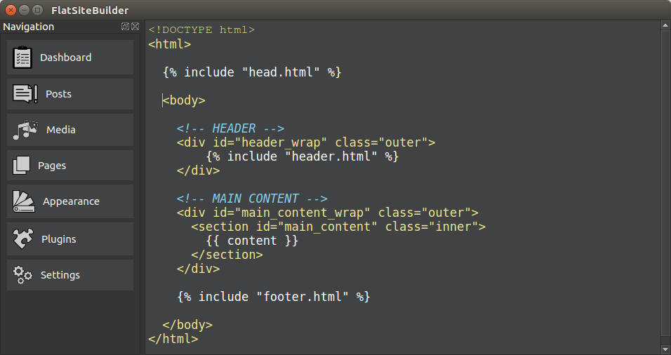

# FlatSiteBuilder

The desktop app is working as a content mangement system and is creating a flat file web content to use with github pages.

# Syntax
The syntax for the templates is based on Django.

## Variable
{{ varname }}

## Includes


## Loop

    {{ page.title }}


## Contact
If you have any feature requests then just send me an email with your ideas to artanidos@gmail.com

## Donations
If you like to support my work on the FlatSiteBuilder you are invited to make a donation.

